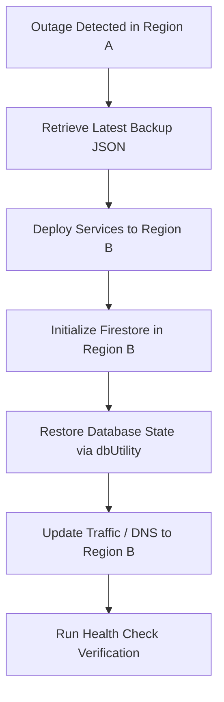

# Guardian Core — Disaster Recovery Plan (§26.16)

This document outlines the disaster recovery architecture, backup strategies, and recovery procedures for Guardian Core production instances.

---

## 🎯 Recovery Objectives
- **Recovery Time Objective (RTO)**: < 30 Minutes (Time to restore service availability).
- **Recovery Point Objective (RPO)**: < 24 Hours (Maximum age of restored data backup).

---

## 💾 Backup Strategy (§26.15)

### 1. Automated Firestore Backups
Firestore supports automated export operations to Google Cloud Storage (GCS).
- **Cron setup**: Executed daily via Cloud Scheduler targeting the Firestore Export API.
- **Export Bucket**: `gs://${PROJECT_ID}-firestore-backups/`

### 2. Manual System Backups (dbUtility CLI)
In addition to native GCP backups, Guardian Core supports complete application state export via `dbUtility.ts`.
To run a manual database backup:
```bash
# SSH into the runner environment or execute via workspace CLI:
npm run db:backup
```
- **Output location**: Saved to `backups/backup-YYYY-MM-DD-T-HH-MM-SS.json`.
- **Contents**: Full state containing Goals, Milestones, Tasks, Notifications, Memory layers (Episodic, Semantic, Preference, Decision, Reflection), Tool Registry, and Audit Logs.

---

## 🔄 Restoration Procedures

### 1. Restore Database from a Manual Backup File
If data corruption occurs, the state can be restored from any valid backup JSON file using the built-in restore script:
```bash
# Stop background workers first to prevent state mutation during restore
# Execute restore CLI:
npm run db:restore -- backups/backup-2026-06-26-T15-30-00.json
```
*Note: This parses the backup file and populates the DB collections. If Firestore is active (`ENABLE_FIRESTORE=true`), it writes to Cloud Firestore. Otherwise, it writes to the local `db.json` file.*

### 2. Native Firestore Import
To restore native Firestore collections from a GCS export:
```bash
gcloud firestore import gs://${PROJECT_ID}-firestore-backups/${BACKUP_FOLDER}/ --project=${PROJECT_ID}
```

---

## 🌎 Regional Failover / Disaster Recovery Flow

If a severe GCP regional outage affects `us-central1`, follow these steps to redeploy the system to a secondary failover region (e.g. `us-east1`):



### Step 1: Deploy Infrastructure to Failover Region
Run the deployment script pointing to the new target region:
```bash
./deploy.sh --project my-gcp-project-id --region us-east1
```

### Step 2: Secret Management Sync
Verify secrets exist in the secondary region. Secrets stored in Secret Manager under the `automatic` replication policy are globally distributed and automatically available in the new region.

### Step 3: Run State Restoration
Using the target database configuration, restore the latest backup:
```bash
# Sets target variables and runs restore
cross-env GOOGLE_CLOUD_PROJECT_ID=my-gcp-project-id ENABLE_FIRESTORE=true npm run db:restore -- backups/latest-backup.json
```

### Step 4: Health & Verification
Verify that the services are UP in the new region:
```bash
curl -f https://guardian-core-api-prod-us-east1.a.run.app/health
```
Once verified, update DNS endpoints or load balancer backends to point to the new Cloud Run instance.
