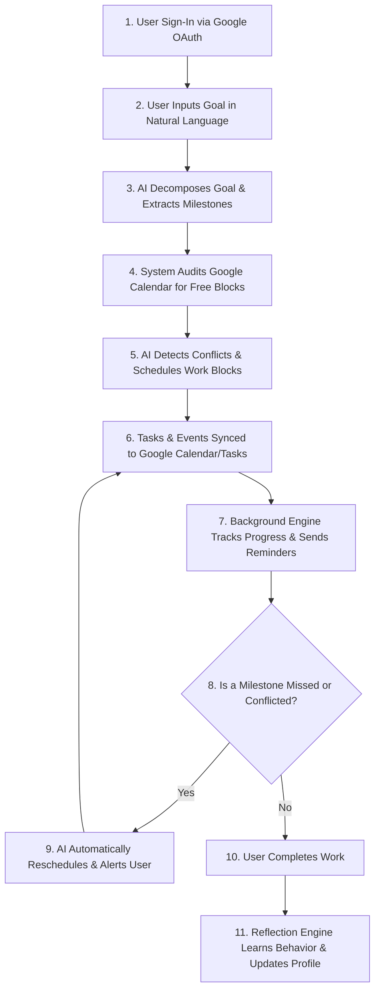

# Guardian Core
## *The Autonomous AI Chief of Staff for Proactive Goal Completion and Time Governance*

---

## 1. Executive Summary

In today’s hyper-connected, high-velocity world, the nature of work has evolved, yet our productivity tools remain fundamentally stagnant. We are inundated with notifications, pinged by alarms, and overwhelmed by checklists—yet deadlines continue to slip. The reason is simple: traditional productivity software is passive. It acts as a digital filing cabinet or a buzzer, placing the entire cognitive burden of planning, execution, and time management back onto the user. 

**Guardian Core** is an AI-first, autonomous productivity companion designed to bridge the gap between planning and execution. Operating like an intelligent, highly context-aware Chief of Staff, Guardian Core doesn’t just remind you of a deadline; it actively helps you meet it. By combining a sophisticated multi-agent cognitive architecture with deep integrations into the Google ecosystem, Guardian Core dynamically decomposes complex goals, resolves scheduling conflicts, adapts to user behavior, and continuously refines its assistance through a closed-loop learning system. It is a paradigm shift from reactive time-tracking to proactive time governance.

---

## 2. Problem Statement: The Failure of Passive Reminders

The fundamental flaw in modern productivity tools is their reliance on **passive reminding**. Traditional calendar and task management applications operate on a simple trigger-response model: the user inputs a task, sets a time, and the application displays a notification when that time arrives. This model fails in several critical areas:

*   **The Cognitive Load of Planning:** Traditional tools require the user to manually break down a massive project (e.g., "Write Research Paper") into actionable steps. They do not help the user figure out *how* or *when* to do the work.
*   **Context-Deaf Scheduling:** Traditional calendars do not understand the contents of the user’s schedule. They will happily let a user set a study block during a time when they are historically fatigued, or schedule a deep-work session immediately following a grueling four-hour meeting.
*   **The "Snooze" Trap:** When a passive reminder fires, it does not account for the user's current situation. If the user is busy or distracted, they dismiss or snooze the notification. Once dismissed, the task disappears from their immediate attention, leading to procrastination and missed deadlines.
*   **Static Inflexibility:** Life is dynamic. When an unexpected meeting is scheduled, or a task takes longer than expected, traditional tools do not automatically adjust. The user must manually reschedule every affected task, leading to "calendar maintenance fatigue" and eventual abandonment of the system.

Ultimately, users do not miss deadlines because they forgot the deadline existed; they miss deadlines because their tools failed to help them allocate, protect, and manage the time required to complete the work.

---

## 3. Solution Overview: The Autonomous Productivity Companion

Guardian Core introduces an entirely new category of productivity software: **Autonomous Time Governance**. Instead of acting as a passive ledger, Guardian Core operates as an active partner in the user's daily life. 

The system treats every goal not as a single date on a calendar, but as a dynamic project that must be actively steered to completion. When a user inputs a goal in natural language, Guardian Core's multi-agent system immediately goes to work:
1.  **Decomposition:** It analyzes the goal and decomposes it into structured, chronological milestones.
2.  **Contextual Allocation:** It audits the user’s Google Calendar to find optimal, conflict-free blocks of time for deep work.
3.  **Active Safeguarding:** It monitors progress continuously. If a milestone is missed or a conflict arises, it doesn't just send an alert—it renegotiates the schedule, offering intelligent alternatives to keep the user on track.
4.  **Continuous Personalization:** It observes how the user interacts with the system, learning their working habits, energy levels, and preferences to make future scheduling increasingly accurate.

By shifting the cognitive load of planning and rescheduling to an autonomous AI, Guardian Core transforms the calendar from a stressful record of commitments into a clear, protected path to success.

---

## 4. Product Vision

The long-term vision for Guardian Core is to become the **intelligent productivity operating system** for professional and personal life. Just as modern operating systems manage hardware resources, memory, and processes to keep a computer running efficiently, Guardian Core manages a user’s most valuable and non-renewable resource: **time**.

As the system evolves, it will transition from an advisory assistant into a fully integrated execution partner. By learning a user’s behavioral patterns over months and years, Guardian Core will be able to predict scheduling conflicts before they happen, automatically negotiate meeting times with other AI agents, curate personalized learning and research material for upcoming tasks, and autonomously handle administrative overhead. The ultimate goal is to give every individual the leverage of an elite Chief of Staff, allowing them to focus entirely on creative and high-value work.

---

## 5. Core Features

Guardian Core is built on a suite of interconnected, intelligent features that work together to provide a seamless productivity experience:

*   **Natural Language Goal Formulation:** Users can express complex, multi-week goals in plain natural language. The AI parses the underlying intent, target dates, and constraints.
*   **Intelligent Milestone Generation:** The system automatically decomposes large goals into a series of logical, sequential milestones with individual intermediate deadlines, preventing last-minute rushes.
*   **Dynamic Calendar Conflict Detection:** Guardian Core continuously monitors the user’s Google Calendar. When a new meeting or event conflicts with a planned work block, the system flags the issue immediately.
*   **Intelligent Auto-Rescheduling:** Rather than forcing the user to manually drag blocks around, the system calculates new, optimal times for displaced work and updates the calendar automatically.
*   **Adaptive, Multi-Channel Reminders:** Reminders are not static. The system adjusts the timing, tone, and channel (e.g., email notifications or dashboard alerts) of reminders based on the urgency of the task and the user's historical responsiveness.
*   **Hidden Task Discovery:** Using advanced semantic analysis, the AI reviews goal descriptions and identifies implicit tasks that the user might have forgotten to plan for (e.g., identifying that "Submit Project" implies a prior task of "Package and Test Code").
*   **Personalized Scheduling & Preference Learning:** The system analyzes user behavior—such as when they complete tasks, when they snooze reminders, and when they reschedule work—to build a personalized profile. It learns if the user is a "morning person" or prefers short, focused bursts over long blocks.
*   **Continuous Reflection & Improvement:** Periodically, the system reflects on past performance, identifying chronic bottlenecks (e.g., "Writing tasks consistently take 30% longer than planned") and adjusts future estimates and scheduling algorithms accordingly.
*   **Shared Memory Architecture:** The system maintains a secure, structured memory of past goals, successful strategies, and user preferences, ensuring that the AI’s assistance becomes more contextual and personalized over time.

---

## 6. End-to-End User Journey

To understand how Guardian Core operates in practice, consider the following end-to-end user journey:



### 1. Seamless Onboarding
The user signs in securely using **Google OAuth**. During onboarding, Guardian Core requests permission to access their Google Calendar and Google Tasks. The home dashboard immediately displays a unified view of their active goals, upcoming milestones, and a visual representation of their daily productivity metrics.

### 2. Goal Creation and Decomposition
The user inputs a goal: *"I want to prepare a comprehensive marketing strategy for our new product launch by the end of next week."* 
The **Understanding Agent** analyzes this input, extracting the final deadline. The **Planning Agent** then breaks this down into three milestones: *Market Research (Due in 3 days)*, *Drafting the Strategy Document (Due in 6 days)*, and *Final Review & Refinement (Due in 9 days)*.

### 3. Contextual Scheduling
Guardian Core queries the user's **Google Calendar**. It detects that the user has a heavy meeting schedule on Tuesday afternoon, but is completely free on Monday morning and Wednesday morning. It also references the user's **Shared Memory**, which indicates they are highly focused on Monday mornings. The system automatically schedules two-hour "Marketing Deep Work" blocks during those optimal times and syncs them to Google Calendar, while creating corresponding tracking items in **Google Tasks**.

### 4. Active Progress Monitoring
As the week progresses, the background worker engine monitors the user's progress. On Tuesday night, the system notices that the "Market Research" milestone has not been marked as complete. Instead of sending a generic alert, the **Negotiation Agent** calculates that the user has a free window on Wednesday afternoon. It sends a gentle notification: *"It looks like Market Research is still pending. I've found an open slot on Wednesday at 2:00 PM to finalize this without delaying your next milestone. Would you like me to reserve it?"*

### 5. Continuous Learning and Adaptation
Upon completion of the goal, the **Reflection Agent** analyzes the history of the project. It notes that the user completed the drafting phase 20% faster than estimated, but required two rescheduling prompts during the research phase. The system updates the user's behavioral profile in **Firestore**, ensuring that future research tasks are allocated more generous buffer times, while writing tasks are scheduled in tighter, more efficient blocks.

---

## 7. AI & The Multi-Agent System

At the heart of Guardian Core is a sophisticated, cooperative **Multi-Agent System**. Instead of relying on a single, monolithic prompt, Guardian Core distributes cognitive responsibilities across several specialized AI agents. These agents collaborate through a centralized coordinator to manage the user's productivity lifecycle:

*   **Understanding Agent:** Responsible for natural language processing. It parses user inputs, extracts semantic intent, identifies implicit deadlines, and translates unstructured text into structured database schemas.
*   **Planning Agent:** The strategist of the system. It takes the structured goals and generates logical, chronological milestone paths. It estimates the effort required for each task and determines dependencies.
*   **Decision Agent (Governance & Autonomy):** Acts as the ethical and operational guardrail. It evaluates proposed actions (like rescheduling a block or sending an urgent alert) against the user’s chosen autonomy level (Advisory, Delegated, or Autonomous), ensuring the AI never makes disruptive changes without appropriate consent.
*   **Memory Agent:** Manages the storage and retrieval of long-term user preferences, past goal histories, and successful behavioral patterns, utilizing semantic ranking to fetch relevant context when a new goal is created.
*   **Negotiation Agent:** Handles scheduling conflicts. When a conflict is detected, this agent negotiates between the user's calendar constraints and the goal’s deadline constraints to find the mathematically and contextually optimal compromise.
*   **Reflection Agent:** The learning core. It reviews completed goals, analyzes discrepancies between planned and actual timelines, detects behavioral drift, and updates the user's cognitive profile with new insights.
*   **Execution Agent:** The action-oriented interface. It translates the decisions of the other agents into concrete API calls, managing the creation, modification, and deletion of events and tasks across external integrations.

---

## 8. Google Technologies Used

Guardian Core leverages a powerful stack of Google technologies, selected for their reliability, intelligence, and seamless integration capabilities:

*   **Gemini API:** Used as the primary cognitive engine for all AI agents. Gemini's advanced reasoning capabilities, long context window, and structural JSON output support allow the multi-agent system to perform complex planning, semantic analysis, and reflection with high precision.
*   **Google AI Studio:** Served as the rapid prototyping and prompt-engineering environment, allowing the development team to refine agent behaviors, test system instructions, and optimize few-shot learning examples.
*   **Cloud Run:** Hosts both the frontend and backend services. Its serverless, containerized architecture allows the application to scale dynamically. The backend is deployed with dedicated resource allocation to support the continuous execution of the background worker engine.
*   **Firestore:** The primary serverless database. Firestore's real-time synchronization, document-oriented structure, and scaling capabilities store user profiles, active goals, hierarchical milestones, audit logs, and agent memory states.
*   **Google OAuth 2.0:** Provides secure, industry-standard user authentication, ensuring that user data is protected and that the application has secure, scoped access to the necessary Google APIs.
*   **Google Calendar API:** Enables two-way synchronization of work blocks and milestones, allowing Guardian Core to read schedule availability, write protected work blocks, and dynamically reschedule events in real time.
*   **Google Tasks API:** Used to synchronize individual milestones and actionable tasks, ensuring that users can view and complete their Guardian Core tasks from within any official Google Tasks client.
*   **Gmail API:** Utilized by the notification engine to send structured, context-aware email digests, progress reports, and urgent rescheduling alerts directly to the user's inbox.

---

## 9. Current Implementation Status

Guardian Core is a fully functional application with a robust core architecture already implemented and tested:

*   **Unified Dashboard:** A premium, responsive web interface that displays active goals, milestone timelines, calendar integrations, and system logs.
*   **Secure Authentication:** Complete Google Sign-In integration with secure session management, token encryption, and automatic refresh cycles.
*   **Multi-Agent Orchestration:** A fully implemented backend agent coordinator that manages the communication, state transitions, and execution loops of all seven specialized agents.
*   **Real-Time Google Integration:** Two-way synchronization with Google Calendar and Google Tasks, supporting real-time event creation, conflict detection, and status updates.
*   **Active Worker Engine:** A background service that runs continuously to monitor deadlines, evaluate goal progress, trigger adaptive reminders, and handle automatic rescheduling.
*   **Firestore Persistence Layer:** A fully integrated database adapter supporting transactional safety, automated retries for network resilience, and local development fallbacks.
*   **Learning and Reflection Engine:** Implemented cognitive feedback loops that analyze completed goals, calculate time-estimation drift, and dynamically promote behavioral observations into active user preferences.
*   **Comprehensive Audit Logging:** A structured logging system that records all critical agent decisions, user actions, and system events for transparency and debugging.

---

## 10. Innovation: Why Guardian Core is Different

Guardian Core stands out from the crowded productivity landscape through several key innovations:

| Dimension | Traditional Tools | Guardian Core |
|---|---|---|
| **Core Design** | Reactive (Wait for user input or set time) | **Proactive** (Actively monitors, plans, and assists) |
| **Cognitive Load** | Placed entirely on the user | **Assumed by AI** (Automatic decomposition & scheduling) |
| **Scheduling** | Static and manual | **Dynamic and adaptive** (Auto-rescheduling on conflict) |
| **Context Awareness** | None (Treats all hours and tasks equally) | **High** (Learns preferences, energy levels, and habits) |
| **Architecture** | Single-threaded database entry | **Cooperative Multi-Agent System** |
| **Closed-Loop Learning** | None (Does not change based on user behavior) | **Continuous Reflection** (Learns from past planning drift) |

By treating time management as a dynamic optimization problem rather than a static list, Guardian Core represents a fundamental evolution in how we interact with productivity software.

---

## 11. Technical Overview

The architecture of Guardian Core is designed for modularity, security, and scalability:

```
[ Frontend: React / Vite ] ──(HTTPS / REST)──> [ Backend: Node.js / Express ]
                                                       │
                                        ┌──────────────┴──────────────┐
                                        ▼                             ▼
                            [ Multi-Agent System ]         [ Background Worker Engine ]
                            (Gemini API / AI Studio)       (Continuous Monitoring Loop)
                                        │                             │
                                        └──────────────┬──────────────┘
                                                       ▼
                                        [ Infrastructure & Services ]
                             (Firestore / Google APIs / Secret Manager)
```

### Frontend
Built using **React** and **Vite** with a modern, responsive design. It utilizes vanilla CSS for a premium, lightweight, and highly interactive user experience. It communicates with the backend via a secure, token-authorized REST API.

### Backend
A **Node.js** and **Express** application written in **TypeScript**. It serves as the API Gateway, enforcing rate limiting, request tracing, security middlewares, and role-based access control.

### AI and Database
Leverages the **Gemini API** for cognitive processing, structured output generation, and semantic analysis. Data is persisted in **Google Cloud Firestore**, utilizing a repository pattern that abstracts database operations and includes automatic retry logic for enterprise-grade resilience.

### Background Workers
A dedicated, single-concurrency execution loop that runs continuously within the backend service. It evaluates active goals, detects calendar conflicts, executes scheduled tasks, and manages the lifecycle of background agents.

---

## 12. Impact: Empowering Diverse Users

Guardian Core is designed to bring elite-level organizational support to a wide variety of users:

*   **Students:** Helps manage chaotic academic schedules, automatically breaking down term papers and exam preparation into daily study blocks, ensuring they start studying weeks in advance rather than cramming the night before.
*   **Professionals:** Assists in managing long-term deliverables alongside daily meeting overhead. By protecting deep-work blocks on their calendars, professionals can ensure they make progress on strategic goals despite constant daily distractions.
*   **Freelancers & Entrepreneurs:** For individuals managing multiple clients or launching new ventures, Guardian Core acts as a virtual business partner, keeping track of diverse milestones, client deadlines, and administrative tasks without the cost of a human assistant.
*   **Researchers:** Decomposes complex literature reviews and writing phases, allowing researchers to maintain steady progress over months-long projects.

---

## 13. Future Roadmap

Guardian Core has a clear path for growth and expansion beyond the hackathon:

*   **Google Drive & Docs Integration:** Allow the system to scan research documents, outline draft structures directly in Google Docs, and organize project files in Google Drive automatically.
*   **Cross-User Collaboration:** Enable multiple Guardian Core agents to communicate and negotiate schedules with one another, allowing teams to coordinate project milestones and meeting times autonomously.
*   **Voice and Multi-Modal Interface:** Integrate voice-based interaction, allowing users to update goals, review their daily schedule, or dictate notes on the go.
*   **Advanced Analytics Dashboard:** Provide users with deep insights into their working habits, showing them when they are most productive, how accurately they estimate task durations, and where their time bottlenecks lie.
*   **Mobile Application:** Develop native iOS and Android clients to provide push notifications, location-aware reminders, and seamless mobile access.

---

## 14. Conclusion

Guardian Core represents the future of personal productivity. By moving beyond the passive, static models of the past, it introduces an active, intelligent, and autonomous companion that understands the value of time. Through its advanced multi-agent architecture, deep integration with Google’s ecosystem, and commitment to continuous learning, Guardian Core does not just remind you of your goals—it walks with you every step of the way to ensure you achieve them.
